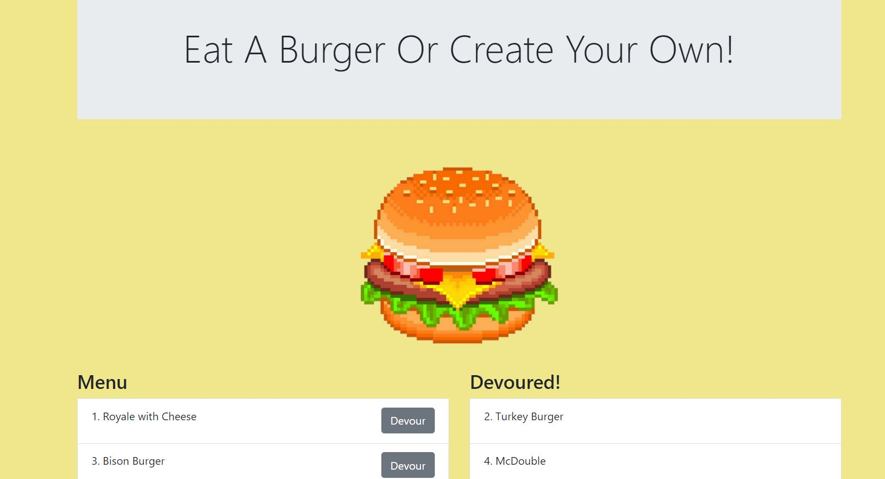

# Express-Burgers



## Description
In this project, I created a burger logger following the Model, View, Controller formula (MVC). A user can input a name of a burger which is logged in the menu list to which the user can click Devour which will then be logged in the Devoured list. 

Deployed Link: 

## Resources Used
* MySQL 
* Node
* ORM
* Express
    * Handlebars

## Table of Contents
* [Installation](#installation)
* [Usage](#usage)
* [Author](#author)


## Installation 
Before installing, you must have Node JS installed. 
Once cloned, navigate to the folder in bash and run the following command:
```javascript
npm i
```
This will install the necessary dependencies, MySQL, Express, and Express-handlebars, to run this application. 

## Usage

Once installed, run ```node server``` to launch the server. Once launched, open your web browser and type ```localhost:8080``` to access the page. 

## Author
[lu-gflores](https://github.com/lu-gflores)